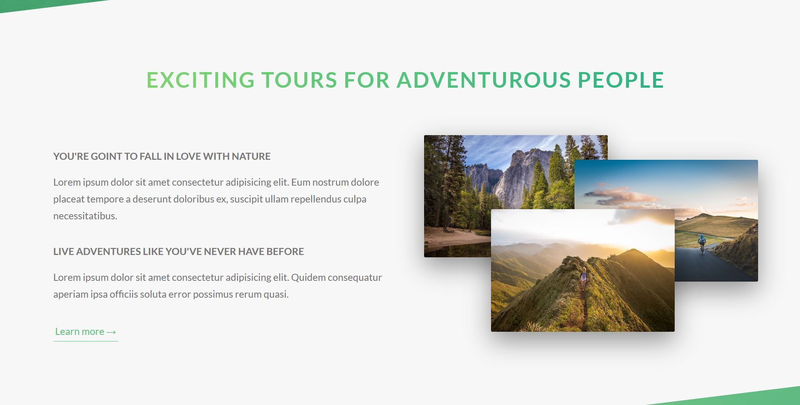

# RESPONSIVE CSS-ANIMATED LANDING PAGE FOR A TARVEL WEBSITE

The goal of this project is to learn and advanced CSS techniques and use Sass. All modern looking features and animation is done by using the most modern CSS.

The Sass 7-1 Pattern is used for this project. You can find out more about the pattern [here](https://sass-guidelin.es/#the-7-1-pattern).

About section. Animated elements are the image composition and the heading. The heading is skewed in both X and Y directions and slightly increased when it's hover over.

When an image is hovered over it comes to the top, slightly increases in size and has a styled border around it.

# DEPENDENCIES

1. [linea.io](http://linea.io/)

# CREDITS

Special thanks to a great online teacher - Jonas Schmedtmann - for his Advanced CSS and Sass: Flexbox, Grid, Animations course.

Copyright &copy; by Jonas Schmedtmann.
You are 100% allowed to use this webpage for both personal and commercial use, but NOT to claim it as your own design. A credit to the original author, Jonas Schmedtmann, is highly appreciated!
